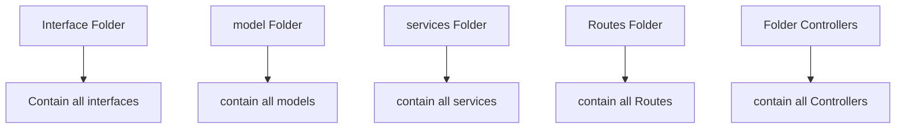
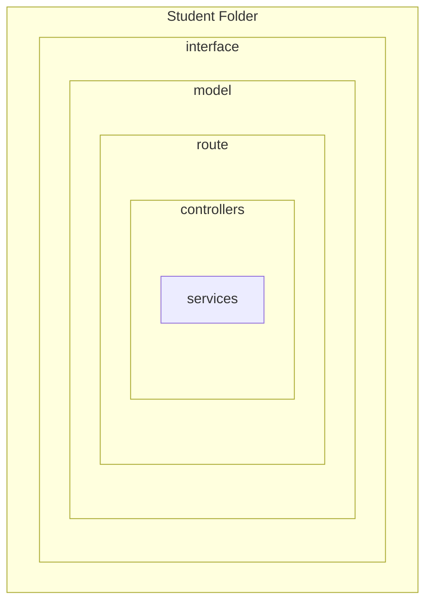
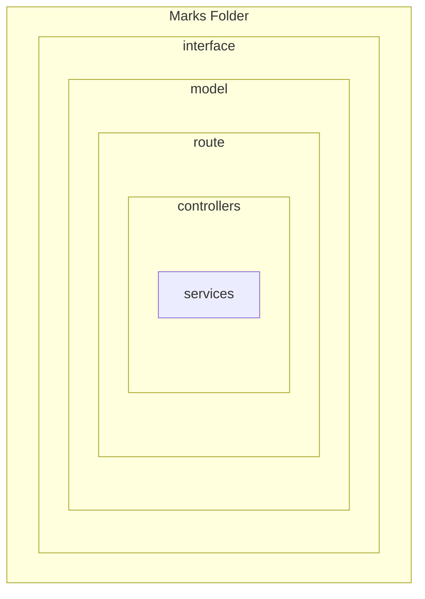
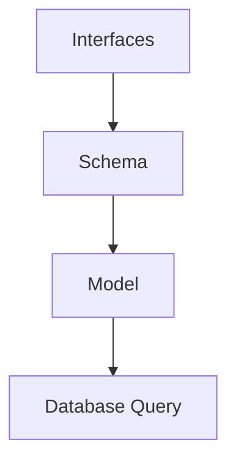
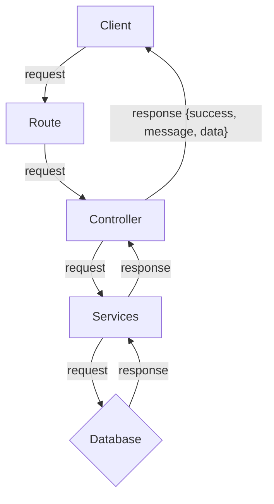

# Mongoose

## What is mongoose ?

- Mongoose is an Object Data Modeling library for mongodb.

## Why we use mongoose?

- Schema Definition
- Model Creation
- Data validation
- Querying
- middleware support
- population .

## Some Common Package that we need:

- express
- typescript
- cors
- mongoose
- dotenv
- eslint
- prettier
- ts-node-dev

## Folder structure:

```$tree/md
    $ Express Js Folder structure
.
├── node_modules
│
├── dist/
├── src/
│   ├── app/
│   ├── app.ts
│   ├── server.ts
│   ├── config/
│           ├─index.ts
├── package.json
├── tsconfig.json
├── .gitignore
├── .env
└── README.md
      ...
```

### Get Current Path:

- 1st way :

```ts
process.cwd();
```

- 2nd way:

```ts
__dirname;
```

## Configure `dotenv` :

- create :file_folder:`configs` at `src/app/`.
- create create a `index.ts` file :
- write codes:

```ts
import dotenv from 'dotenv';
import path from 'path';

// dotenv setup with process.cwd() :
dotenv.config({ path: path.join(process.cwd() + '.env') });
// console.log(process.cwd() + ".env");

export = {
  port: process.env.PORT,
  database_url: process.env.DATABASE_URI,
};
```

## Install & setup Eslint & Prettier :

- #### [read this blog](https://blog.logrocket.com/linting-typescript-eslint-prettier)
- run this command :

```ts
   npm install eslint @typescript-eslint/parser @typescript-eslint/eslint-plugin --save-dev
   // install this packages as dev dependencies:
   // eslint
   // @typescript-eslint/parser
   // @typescript-eslint/eslint-plugin
```

- ### Initialize Eslint or create Eslint configuration:

  - it's provide an configuration. `.eslintrc.json` file
  - run the command :

  ```ts
       npx eslint --init
  ```

  - ##### Then ans the belows question on terminal step by step :

  ```ts
     How would you like to use ESLint?
     What type of modules does your project use?
     Which framework does your project use?
     Does your project use TypeScript?
     Where does your code run?
     How would you like to define a style for your project?
  ```

  - create an `.eslintignore` file and `dist` and `node_modules`

  ```eslint
  dist
  node_modules
  ```

  - ##### Add Two script: `package.json`

  ```json
        "scripts": {
              "lint": "eslint src --ignore-path .eslintignore --ext  .ts",
              "lint:fix": "npx eslint src --fix"
         },
  ```

  - ##### Add some rules : in `.eslintrc.json`

  ```json
     "rules": {
        "/no-unused-vars": "error",
        "no-unused-expressions": "error",
        "prefer-const": "error",
        "no-undef": "error",
        "no-console": "warn"
     },


  ```

  - ##### Add Globals

  ```json
   "globals": {
        "process": "readonly"
     }
  ```

  - ##### Edit extends In `.eslintrc.json` : This helps to save from conflict of prettier and eslint.

  ```json
    "extends": [
   "eslint:recommended",
   "plugin:@typescript-eslint/recommended",
   "prettier"
  ],
  ```

## Install Prettier :

- ### Installation:
  ```ts
     npm install --save-dev prettier
  ```
- ### Create `.prettierrc.json` and this file:

  ```json
  {
    "semi": false, // Specify if you want to print semicolons at the end of statements
    "singleQuote": true // If you want to use single quotes
  }
  ```

- ### Install and `two script` on `package.json` for prettier:
  - to Format with prettier:
  ```json
     "prettier" : "prettier --ignore-path .gitignore --write \"./src/**/*.+(js|ts|json)\",
     "prettier:fix" : "npx prettier --write src"
  ```
- ### Install another `eslint-config-prettier` to handle eslint and prettier
  conflict.
  ```ts
     npm install --save-dev eslint-config-prettier
  ```
- ### Edit extends In `.eslintrc.json` : This helps to save from conflict of prettier and eslint.

  ```json
    "extends": [
   "eslint:recommended",
   "plugin:@typescript-eslint/recommended",
   "prettier"
  ],
  ```

## Install `ts-node-dev` to run `server.ts`:

- ### install :
  ```ts
     npm i ts-node-dev --save-dev
  ```
- ### Add an script on `package.json` :

  ```json
     "start:dev": "ts-node-dev --respawn --transpile-only ./src/server.ts"

  ```

## Software Design Pattern

- There many software design pattern like `mvc` and `modular` pattern
- ### MVC Pattern :



- ### Modular Pattern :

```mermaid
graph TD
subgraph A[Teacher Folder]
   subgraph B[interface]
      subgraph C[model]
         subgraph D[route]
             subgraph E[controllers]
                F[services]
             end
         end
      end
   end
end

```







## Benefits of Modular Pattern:

1. Scalability
2. Maintainability
3. Better Refactoring
4. Efficient Development

## Follow rules :

- #### Dry : Don't Repeat Your Code
- #### FAT Model / Thin Controller

## We follow the rules on our express application :



## Request & Response Flow in `Modular Pattern :`



# Some Important Middleware Function

- ## Global error handler:

  ```ts
  import { NextFunction, Request, Response } from 'express';

  const globalErrorHandler = async (
    err: any,
    req: Request,
    res: Response,
    next: NextFunction,
  ) => {
    const statusCode = 500;
    const message = err.message || 'something went wrong';

    return res.status(statusCode).json({
      success: true,
      message,
      err: '',
    });
  };

  export default globalErrorHandler;
  ```

  - ## NotFound Route Middleware:

  ```ts
  import { NextFunction, Request, Response } from 'express';
  import httpStatus from 'http-status';

  // eslint-disable-next-line @typescript-eslint/no-unused-vars, no-unused-vars
  export const notFound = (req: Request, res: Response, next: NextFunction) => {
    return res.status(httpStatus.NOT_FOUND).json({
      success: false,
      message: 'API Not Found',
      error: '',
    });
  };
  ```

# Router Management :

- Create a :file_folder: `routes`
- Then create a `index.ts` file
- create an object with routes and it's path
- then loop the route and use `router.use(router.path, router.route)`

- Example :

```ts
import express from 'express';
import { StudentRoutes } from '../modules/student/student.route';
import { userRouter } from '../modules/user/user.route';

const router = express.Router();

// router.use('/students', StudentRoutes);
// router.use('/users', userRouter);

const modulesRoute = [
  {
    path: '/students',
    route: StudentRoutes,
  },
  {
    path: '/users',
    route: userRouter,
  },
];

modulesRoute.forEach((route) => router.use(route.path, route.route));

export default router;
```

# Hoc Function In Express JS:

- ## `catchAsync`: It's a HOC Function thats helps us to don't repeat `try` and `catch`

  - Syntax:

  ```ts
  const catchAsync = (fn: RequestHandler) => {
    return (req: Request, res: Response, next: NextFunction) => {
      Promise.resolve(fn(req, res, next)).catch((err) => next(err));
    };
  };
  ```

  - use Case:

  ```ts
  const getAllStudents: RequestHandler = catchAsync(async (req, res, next) => {
    const students = await StudentServices.getAllStudentFromDB();
    sendResponse(res, {
      statusCode: httpStatus.OK,
      success: true,
      message: 'Student retrieved successfully',
      data: students,
    });
  });
  ```

# Utility Functions:

- ## `sendResponse` : Send Response helps us don't repeat `response` code .

  - Syntax:

    ```ts
    import { Response } from 'express';

    type TResponse<T> = {
      statusCode: number;
      success: boolean;
      message: string;
      data: T;
    };

    const sendResponse = <T>(res: Response, data: TResponse<T>) => {
      res.status(data.statusCode).json({
        success: data.success,
        message: data.message,
        data: data.data,
      });
    };

    export default sendResponse;
    ```

  - use Case:

  ```ts
  const getAllStudents: RequestHandler = catchAsync(async (req, res, next) => {
    const students = await StudentServices.getAllStudentFromDB();

    // send response use to send message on client side :
    sendResponse(res, {
      statusCode: httpStatus.OK,
      success: true,
      message: 'Student retrieved successfully',
      data: students,
    });
  });
  ```

# `Population ` in Mongoose :

- `populate` used to get `ref` field data.

- ### `populate(propertyName)`:

  - syntax:

  ```ts
  Model.find().populate('propertyName');
  ```

  - Example:

  ```ts
  // get students:
  const getAllStudentFromDB = async () => {
    const students = await Student.find({})
      .populate('admissionSemester') // only single property population
      .populate({
        // nested property population
        path: 'academicDepartment',
        populate: {
          path: 'academicFaculty',
        },
      });

    return students;
  };
  ```

- ### Nested `population`:

  - syntax :

  ```ts
  Model.find().populate({
    path: 'propertyName', // parent population
    populate: {
      // children property population
      path: 'propertyName',
    },
  });
  ```

  - Example:

  ```ts
  const getAllStudentFromDB = async () => {
    const students = await Student.find({})
      .populate('admissionSemester')
      .populate({
        path: 'academicDepartment',
        populate: {
          path: 'academicFaculty',
        },
      });

    return students;
  };
  ```

# AppError Class :

- create an app error class to pass status code and stack on `Error` class.
- create a :file_folder:`errors`.
- create :blue_book:`AppError.ts` file
- then write below codes :

```ts
// here we extends Error Class: Error is Super Class and AppError Derived Class
class AppError extends Error {
  public statusCode: number;

  constructor(statusCode: number, message: string, stack = '') {
    // send message to super class with super key:
    super(message);
    // assign statusCode : get this code from user:
    this.statusCode = statusCode;

    if (stack) {
      this.stack = stack;
    } else {
      // call the error captureStackTrace() function
      // this func get current object and it's constructor.
      Error.captureStackTrace(this, this.constructor);
    }
  }
}
```

- Use Case:

```ts
throw new AppError(httpStatus.NOT_FOUND, 'The user Not exists');
```

# `Transaction` and `Rollback` in Express & Mongoose :

- Transaction has follows and important role `ACID`.
- A means `Atomicity` , C means `Consistency` , I means `Isolated`, D means `Durability`.

- ### Transaction Steps :

  - #### `startSession()`: `startSession()` used to create a session or transaction environment.
  - #### `startTransaction()`: `startTransaction()` use to start Transaction.
  - #### `commitTransaction()`: `commitTransaction()` used to close transaction if transaction held successfully
  - #### `abortTransaction()` : `abortTransaction()` used to `rollback transaction` if transaction any operation filed.
  - #### `endSession()`: used to end to session.
  - #### Flowchart of Transaction and Rollback:

  ```mermaid

  graph TD

    A[startSession]-->B[startTransaction]

   B-(if success)->C[commitTransaction]
   B-(if failed)->D[abortTransaction]-->E[endSession]
   C-->E


  ```

# Errors In Express Application:

- ### Operational Error :
  - Invalid User Input
  - Failed to Run Server.
  - Failed to connect database.
  - Invalid Auth Token.
- ### Programmatically Error
  - using undefined
  - using properties that not exists.
  - using number instead of string
  - using req.params instead of req.query.
- ### UnhandledRejection (Asynchronous Code)
- ### Unhandled Exception (Synchronous Code Error)

# Error Handling :

- ### Handle Zod Validation Error :

```ts
import httpStatus from 'http-status';
import { ZodError } from 'zod';
import { ISendErrorResponse } from '../interfaces/errors';

const handleZodError = (err: ZodError): ISendErrorResponse => {
  const errorSources = err.issues.map((issue) => {
    return {
      path: issue.path[issue.path.length - 1],
      message: issue.message,
    };
  });

  return {
    statusCode: httpStatus.BAD_REQUEST,
    message: 'Validation Error!!!',
    errorSources,
  };
};

export default handleZodError;
```

- ### Handle Mongoose Validation Error :

```ts
import mongoose from 'mongoose';
import { IErrorSources, ISendErrorResponse } from '../interfaces/errors';
import httpStatus from 'http-status';

const handleValidationError = (
  err: mongoose.Error.ValidationError,
): ISendErrorResponse => {
  const errorSources: IErrorSources[] = Object.values(err.errors).map(
    (val: mongoose.Error.ValidatorError | mongoose.Error.CastError) => {
      return {
        path: val.path,
        message: val.message,
      };
    },
  );

  const statusCode: number = httpStatus.BAD_REQUEST;

  return {
    statusCode,
    message: 'Validation Error',
    errorSources,
  };
};

export default handleValidationError;
```

- ### Handler Mongoose Cast Error :

```ts
import mongoose from 'mongoose';
import { IErrorSources, ISendErrorResponse } from '../interfaces/errors';
import httpStatus from 'http-status';

const handleCastError = (err: mongoose.Error.CastError): ISendErrorResponse => {
  const errorSources: IErrorSources[] = [
    {
      path: err.path,
      message: err.message,
    },
  ];
  return {
    statusCode: httpStatus.BAD_REQUEST,
    message: 'Invalid ID',
    errorSources,
  };
};

export default handleCastError;
```

- Handle Mongoose Duplicate Error:

```ts
/* eslint-disable @typescript-eslint/no-explicit-any */
import httpStatus from 'http-status';
import { IErrorSources, ISendErrorResponse } from '../interfaces/errors';

const handleDuplicateError = (err: any): ISendErrorResponse => {
  const key = Object.keys(err.keyPattern)[0];
  const errorSources: IErrorSources[] = [
    {
      path: key,
      message: ` "The ${err.keyValue[key]}"  is already Exists`,
    },
  ];
  const statusCode: number = httpStatus.BAD_REQUEST;

  return {
    statusCode,
    message: `Path "${key}" is already Exists`,
    errorSources,
  };
};

export default handleDuplicateError;
```

- ### Call the function in Global Error Handler:

```ts
/* eslint-disable no-unused-vars */
/* eslint-disable @typescript-eslint/no-unused-vars */
import { ErrorRequestHandler } from 'express';
import httpStatus from 'http-status';
import { ZodError } from 'zod';
import configs from '../configs';
import { IErrorSources } from '../interfaces/errors';
import handleZodError from '../errors/handleZodError';
import handleValidationError from '../errors/handleValidationError';
import handleCastError from '../errors/handleCastError';
import handleDuplicateError from '../errors/handleDuplicateError';
import AppError from '../errors/AppError';

const globalErrorHandler: ErrorRequestHandler = async (err, req, res, next) => {
  // default setting here:
  
  let statusCode: number = httpStatus.INTERNAL_SERVER_ERROR;
  let message: string = 'Something Went Wrong!!!';

  let errorSources: IErrorSources[] = [
    {
      path: '',
      message: 'Something went wrong!!!',
    },
  ];

  if (err instanceof ZodError) {
    // call zod error handler func:
    const simplifiedError = handleZodError(err);

    statusCode = simplifiedError.statusCode;
    message = simplifiedError.message;
    errorSources = simplifiedError.errorSources;
  } else if (err?.name === 'ValidationError') {
    const simplifiedError = handleValidationError(err);
    statusCode = simplifiedError.statusCode;
    message = simplifiedError.message;
    errorSources = simplifiedError.errorSources;
  } else if (err?.name === 'CastError') {
    const simplifiedError = handleCastError(err);
    statusCode = simplifiedError.statusCode;
    message = simplifiedError.message;
    errorSources = simplifiedError.errorSources;
  } else if (err?.code === 11000) {
    const simplifiedError = handleDuplicateError(err);
    statusCode = simplifiedError.statusCode;
    message = simplifiedError.message;
    errorSources = simplifiedError.errorSources;
  } else if (err instanceof AppError) {
    statusCode = err.statusCode;
    message = err.message;
    errorSources = [
      {
        path: '',
        message: err?.message,
      },
    ];
  } else if (err instanceof Error) {
    message = err?.message;
  }

  return res.status(statusCode).send({
    success: false,
    message,
    errorSources,
    err,
    stack: configs.node_env === 'development' ? err.stack : null,
  });
};

export default globalErrorHandler;
```

- ### Handle `unhandledRejection` for asynchronous code error:

```ts
process.on('unhandledRejection', () => {
  if (server) {
    server.close(() => {
      process.exit(1);
    });
  }
  process.exit(1);
});
```

- ### Handle `unCaughtException` for synchronous code error:

```ts
process.on('unCaughtException', () => {
  process.exit(1);
});
```

# `Search Term` in Express Mongoose with `$regex`:

- we can received query `searchTerm` from frontend in `req.query`
- then we write a query like below:
- we use `$or` to search from multiple filed :
- The search pattern syntax:

```ts
  Model.find({
    $or: [
      {<field>: {$regex: searchPattern, $options: "i"}},
      {<field>: {$regex: searchPattern, $options: "i"}},
      {<field>: {$regex: searchPattern, $options: "i"}},
    ]

  })

/**
 * access @query property from @request object.
 * then get the @searchTerm value
 * we want to search in our collection by using @searchTerm in some specific fileds.
 * we create an @array of field by using which we need to @search .
 * we create a query by using @map and pass that mapping @return value as $or value
 * the query pattern :
 * {$or : [{field: {$regex: searchTerm , $options: 'i'} }, {field: {$regex: searchTerm , $options: 'i'} }]}
 */
```

- we can build this by using `array.prototype.map()`:

```ts
{
  $or: ['fieldOne', 'fieldTwo', 'fieldThree'].map((filed) => {
    return {
      [field]: { $regex: searchPattern, $options: 'i' },
    };
  });
}
```

- Example:

```ts
// get students:
const getAllStudentFromDB = async (query: Record<string, unknown>) => {
  // searchTerm :
  let searchTerm: string = '';

  if (query?.searchTerm) {
    searchTerm = query.searchTerm as string;
  }

  console.log(searchTerm);

  const students = await Student.find({
    $or: ['email', 'name.firstName', 'name.middleName'].map((field: string) => {
      return {
        [field]: { $regex: searchTerm, $options: 'i' },
      };
    }),
  })
    .populate('admissionSemester')
    .populate({
      path: 'academicDepartment',
      populate: {
        path: 'academicFaculty',
      },
    });

  return students;
};
```

## Search , filter, sort, limit, skip, select with Function :

```ts
const getAllStudentFromDB = async (query: Record<string, unknown>) => {
  console.log(query);
  // copy the query:
  const queryObj = { ...query };

  // excluding fields :
  const excludeFields = ['searchTerm', 'sort', 'limit', 'page', 'fields'];
  excludeFields.forEach((el: string) => delete queryObj[el]);

  // search Query :
  let searchTerm: string = '';
  if (query.searchTerm) {
    searchTerm = query.searchTerm as string;
  }

  // sort Query:
  const sort: string = (query.sort as string) || '-createdAt';

  // Query Limit :
  const limit: number = query.limit ? Number(query.limit) : 1;

  // Page:
  const page: number = Number(query?.page) || 1;

  // fields :

  const fields: string =
    (query?.fields as string)?.split(',').join(' ') || '-__v';

  console.log(queryObj);

  // searchQuery:
  const searchQuery = Student.find({
    $or: ['name.firstName', 'email', 'presentAddress'].map((field: string) => {
      return {
        [field]: { $regex: searchTerm, $options: 'i' },
      };
    }),
  });

  // Filter Query:
  const FilterQuery = searchQuery
    .find(queryObj)
    .populate('admissionSemester')
    .populate({
      path: 'academicDepartment',
      populate: {
        path: 'academicFaculty',
      },
    });

  // Sort Query :

  const sortQuery = FilterQuery.sort(sort);

  // paginated Query:
  const paginateQuery = sortQuery.skip((page - 1) * limit);

  // Limit Query:
  const limitQuery = paginateQuery.limit(limit);

  // select query:

  const selectQuery = await limitQuery.select(fields);

  return selectQuery;

  //
};
```

## Query Builder with `Class`:

- Syntax:

```ts
import { FilterQuery, Query } from 'mongoose';

class QueryBuilder<T> {
  public modelQuery: Query<T[], T>;
  public query: Record<string, unknown>;

  // create a constructor to assign modelQuery and query:
  constructor(modelQuery: Query<T[], T>, query: Record<string, unknown>) {
    this.modelQuery = modelQuery;
    this.query = query;
  }

  // create a search  method:
  search(searchFields: string[]) {
    const searchTerm: string = (this.query.searchTerm as string) || '';
    this.modelQuery = this.modelQuery.find({
      $or: searchFields.map((field: string) => {
        return {
          [field]: { $regex: searchTerm, $options: 'i' },
        };
      }),
    } as FilterQuery<T>);

    return this;
  }

  // create a filter method:

  filter() {
    // copy the query:
    const queryObject = { ...this.query };

    // excluding fields array:
    const excludeFields = ['searchTerm', 'sort', 'limit', 'page', 'fields'];

    //exclude now :
    excludeFields.forEach((el: string) => delete queryObject[el]);

    //filter now :
    this.modelQuery = this.modelQuery.find(queryObject as FilterQuery<T>);

    return this;
  }

  // create as sort function :
  sort() {
    const sort = this.query.sort
      ? (this?.query?.sort as string)?.split(',')?.join(' ')
      : '-createdAt';

    this.modelQuery = this.modelQuery.sort(sort);

    return this;
  }

  // paginate method:

  paginate() {
    const limit = Number(this.query.limit) || 10;
    const page = Number(this.query.page) || 1;
    const skip = (page - 1) * limit;
    this.modelQuery = this.modelQuery.skip(skip).limit(limit);

    return this;
  }

  // select fields method :
  fields() {
    const fields =
      (this?.query?.fields as string)?.split(',')?.join(' ') || '-__v';

    this.modelQuery = this.modelQuery.select(fields);
    return this;
  }
}

export default QueryBuilder;
```
